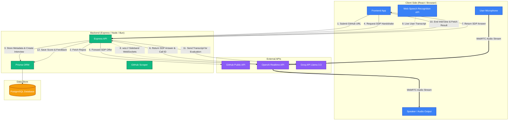

# 🎙️ GitVoice AI

An advanced, real-time, voice-driven AI technical interviewer platform. This application leverages **OpenAI's Realtime WebRTC API** for low-latency voice communications, uses a **Sideband WebSocket Connection** to inject candidate-specific GitHub metadata, implements browser-native **Web Speech Recognition** for candidate transcription, and evaluates final interviews using **Groq (Llama 3.3 70B)**.

Developed originally as part of a demonstration project, this platform showcases state-of-the-art AI agent mechanics using a modern monorepo layout orchestrated with **Turborepo** and powered by **Bun**.

---

## 🏗️ Architecture Diagrams

To understand the lifecycle and orchestration of an interview session, refer to the following structural and interactive flow diagrams.

###  System Components & Data Architecture
This diagram displays how frontend and backend services interact with local databases and third-party APIs during a session:




## 🛠️ Monorepo Structure

The project is structured as a Turborepo workspace using Bun:

```text
├── apps
│   ├── backend             # Express server handling handshakes, WS sideband, database, and evaluation
│   └── frontend            # React frontend containing routing, voice visualizers, and WebRTC logic
├── packages
│   ├── eslint-config       # Shared linting configurations
│   ├── typescript-config   # Shared TypeScript definitions
│   └── ui                  # Shared design components
├── package.json            # Root project definitions and monorepo workspaces configuration
└── turbo.json              # Turborepo task pipeline configuration
```

### Key Source Files

*   **Backend Application:**
    *   [apps/backend/index.ts](file:///d:/Documents/Backend/Project/ai_interviewer2/code/ai-interviewer/apps/backend/index.ts): Holds core REST endpoints for session setup, message log updates, and results fetching.
    *   [apps/backend/sideband.ts](file:///d:/Documents/Backend/Project/ai_interviewer2/code/ai-interviewer/apps/backend/sideband.ts): Manages the background WebSocket (`wss://`) connection with OpenAI. It provides dynamic instruction tuning (injecting scraped GitHub repositories data) and logs the interviewer’s transcripts to Postgres.
    *   [apps/backend/result.ts](file:///d:/Documents/Backend/Project/ai_interviewer2/code/ai-interviewer/apps/backend/result.ts): Integrates with Groq API (`llama-3.3-70b-versatile`) to generate candidate feedback and score.
    *   [apps/backend/prisma/schema.prisma](file:///d:/Documents/Backend/Project/ai_interviewer2/code/ai-interviewer/apps/backend/prisma/schema.prisma): Database definitions representing the relational layout of `Interview` records and `Message` logs.
*   **Frontend Application:**
    *   [apps/frontend/src/components/Form.tsx](file:///d:/Documents/Backend/Project/ai_interviewer2/code/ai-interviewer/apps/frontend/src/components/Form.tsx): The onboarding portal where a candidate initiates a session using their GitHub URL.
    *   [apps/frontend/src/components/Interview.tsx](file:///d:/Documents/Backend/Project/ai_interviewer2/code/ai-interviewer/apps/frontend/src/components/Interview.tsx): Manages user permissions, starts the `RTCPeerConnection` for direct audio streaming to OpenAI, triggers the `SpeechRecognition` listener to stream candidate transcripts, and tracks voice inputs for UI rendering.
    *   [apps/frontend/src/components/VoiceOrb.tsx](file:///d:/Documents/Backend/Project/ai_interviewer2/code/ai-interviewer/apps/frontend/src/components/VoiceOrb.tsx): A premium, dynamic SVG visualizer displaying voice waves reacting to real-time volume levels.
    *   [apps/frontend/src/components/Result.tsx](file:///d:/Documents/Backend/Project/ai_interviewer2/code/ai-interviewer/apps/frontend/src/components/Result.tsx): Summarizes the conversation transcripts alongside an AI evaluation dashboard showing scores and qualitative critiques.

---

## 🌟 Key Technical Implementations

### 1. Peer-to-Peer Voice Integration (WebRTC)
Rather than proxying large binary audio payloads through the backend, the client establishes an `RTCPeerConnection` and swaps session descriptions (SDP offer/answer) with OpenAI via the backend. This allows the browser to send microphone inputs directly to OpenAI and receive synthesized voice responses with sub-second latency.

### 2. Instruction Tuning via Sideband WebSockets
Once OpenAI generates a calls session, the backend establishes a secondary WebSockets connection (`wss://api.openai.com/v1/realtime?call_id=${callId}`). The backend triggers a `session.update` to instruct the AI with custom prompts, incorporating the candidate's GitHub public repository information.

### 3. Dual-Channel Transcription Storage
Since audio exchange occurs directly between the browser and OpenAI:
*   The **Assistant's messages** are intercepted on the server by listening to `response.done` events inside the background WebSocket and logged directly.
*   The **User's messages** are transcribed locally using browser-native Speech Recognition (`SpeechRecognition` / `webkitSpeechRecognition`) and uploaded via HTTP request intervals to align conversation transcripts.

---

## 🚀 Getting Started

### 📋 Prerequisites
Ensure you have the following installed on your machine:
*   [Bun](https://bun.sh/) (v1.1 or higher)
*   [PostgreSQL Database](https://www.postgresql.org/) (or a cloud provider like Supabase)

### 🔑 Environment Variables Setup
Create an `.env` file inside [apps/backend/.env](file:///d:/Documents/Backend/Project/ai_interviewer2/code/ai-interviewer/apps/backend/.env) containing:

```env
# Database Credentials
DATABASE_URL="postgresql://<username>:<password>@<host>:<port>/<db_name>?schema=public"

# OpenAI Token (Must have access to the OpenAI Realtime / Calls API)
OPENAI_KEY="sk-proj-..."

# Groq Token (Used for final Llama 3.3 evaluations)
GROQ_API_KEY="gsk_..."

# Optional HTTP Proxy for GitHub Scraping (if rate-limited)
PROXY_URL=""
```

### 📦 Installation
From the root workspace directory, install dependencies:

```bash
bun install
```

### 🗄️ Database Seeding & Migration
Navigate to the backend directory, then set up the Postgres schema:

```bash
cd apps/backend
bunx prisma migrate dev
```

### 💻 Development Server
Start both the Frontend and Backend applications concurrently using Turborepo from the root directory:

```bash
bun dev
```

This will spin up:
*   **Frontend Application**: `http://localhost:5173` (configured under Bun dev Server)
*   **Backend Server**: `http://localhost:3002`

---

## 🎬 Original Video Reference
This project is built based on the architecture described in Harkirat Singh's YouTube Tutorial.
*   **Video Link**: [Build a real-time AI interviewer with OpenAI Realtime API](https://www.youtube.com/watch?v=iNJ7z4YLQFk)